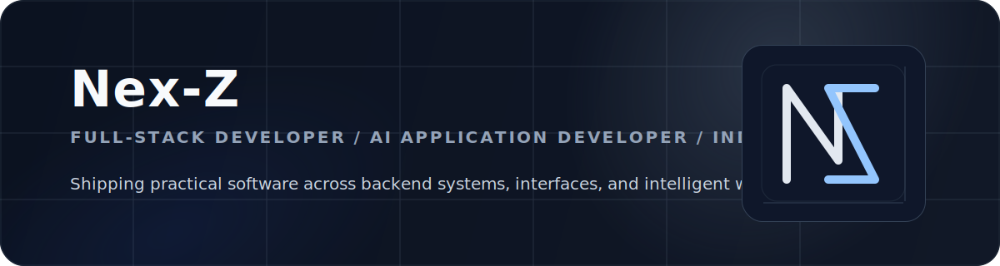

  

  全栈开发者 / AI 应用开发者 / 独立开发者

  Full-Stack Developer / AI Application Developer / Indie Developer

  

## 关于 / About

- 全栈开发，覆盖 API 设计、系统实现与前端交付。 / Full-stack engineering from API design to frontend delivery.
- 聚焦 AI 应用、MCP 工具链与可落地的智能工作流。 / Focused on AI applications, MCP tooling, and practical intelligent workflows.
- 偏爱简洁、耐用、可长期维护的独立软件产品。 / I prefer restrained, durable software with long-term maintainability.

## GitHub 概览 / Snapshot

  <picture>
    <source
      media="(prefers-color-scheme: dark)"
      srcset="https://github-readme-stats.vercel.app/api?username=Nex-Z&amp;show_icons=true&amp;hide_title=true&amp;hide_border=true&amp;rank_icon=github&amp;bg_color=00000000&amp;title_color=c9d1d9&amp;text_color=8b949e&amp;icon_color=58a6ff"
    />
    <source
      media="(prefers-color-scheme: light)"
      srcset="https://github-readme-stats.vercel.app/api?username=Nex-Z&amp;show_icons=true&amp;hide_title=true&amp;hide_border=true&amp;rank_icon=github&amp;bg_color=ffffff00&amp;title_color=1f2328&amp;text_color=656d76&amp;icon_color=0969da"
    />
    
  </picture>
  <picture>
    <source
      media="(prefers-color-scheme: dark)"
      srcset="https://github-readme-stats.vercel.app/api/top-langs/?username=Nex-Z&amp;layout=compact&amp;hide_border=true&amp;langs_count=8&amp;bg_color=00000000&amp;title_color=c9d1d9&amp;text_color=8b949e"
    />
    <source
      media="(prefers-color-scheme: light)"
      srcset="https://github-readme-stats.vercel.app/api/top-langs/?username=Nex-Z&amp;layout=compact&amp;hide_border=true&amp;langs_count=8&amp;bg_color=ffffff00&amp;title_color=1f2328&amp;text_color=656d76"
    />
    
  </picture>

  <picture>
    <source
      media="(prefers-color-scheme: dark)"
      srcset="https://streak-stats.demolab.com?user=Nex-Z&amp;hide_border=true&amp;background=00000000&amp;stroke=30363d&amp;ring=58a6ff&amp;fire=58a6ff&amp;currStreakNum=c9d1d9&amp;currStreakLabel=c9d1d9&amp;sideNums=c9d1d9&amp;sideLabels=8b949e&amp;dates=8b949e"
    />
    <source
      media="(prefers-color-scheme: light)"
      srcset="https://streak-stats.demolab.com?user=Nex-Z&amp;hide_border=true&amp;background=FFFFFF00&amp;stroke=e4e2e2&amp;ring=0969da&amp;fire=0969da&amp;currStreakNum=1f2328&amp;currStreakLabel=1f2328&amp;sideNums=1f2328&amp;sideLabels=656d76&amp;dates=656d76"
    />
    
  </picture>

  <picture>
    <source
      media="(prefers-color-scheme: dark)"
      srcset="https://github-profile-trophy.vercel.app/?username=Nex-Z&amp;theme=algolia&amp;no-bg=true&amp;no-frame=true&amp;row=1&amp;column=6&amp;margin-w=12"
    />
    <source
      media="(prefers-color-scheme: light)"
      srcset="https://github-profile-trophy.vercel.app/?username=Nex-Z&amp;theme=flat&amp;no-bg=true&amp;no-frame=true&amp;row=1&amp;column=6&amp;margin-w=12"
    />
    
  </picture>

  <picture>
    <source
      media="(prefers-color-scheme: dark)"
      srcset="https://github-readme-activity-graph.vercel.app/graph?username=Nex-Z&amp;bg_color=00000000&amp;color=8b949e&amp;line=58a6ff&amp;point=c9d1d9&amp;area=true&amp;area_color=1f6feb&amp;hide_border=true"
    />
    <source
      media="(prefers-color-scheme: light)"
      srcset="https://github-readme-activity-graph.vercel.app/graph?username=Nex-Z&amp;bg_color=ffffff00&amp;color=656d76&amp;line=0969da&amp;point=1f2328&amp;area=true&amp;area_color=ddf4ff&amp;hide_border=true"
    />
    
  </picture>

