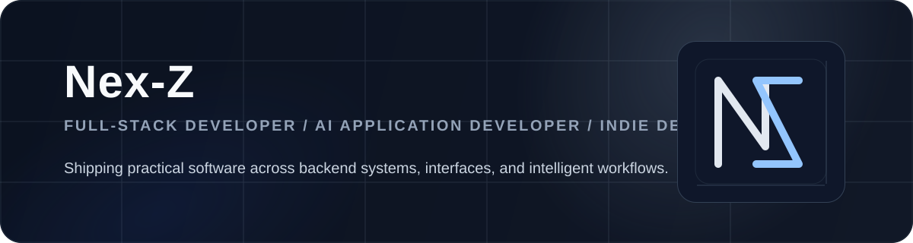
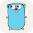
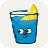

  

  全栈开发者 / AI 应用开发者 / 独立开发者

  Full-Stack Developer / AI Application Developer / Indie Developer

  

## 关于 / About

- 全栈开发，覆盖 API 设计、系统实现与前端交付。 / Full-stack engineering from API design to frontend delivery.
- 聚焦 AI 应用、MCP 工具链与可落地的智能工作流。 / Focused on AI applications, MCP tooling, and practical intelligent workflows.
- 偏爱简洁、耐用、可长期维护的独立软件产品。 / I prefer restrained, durable software with long-term maintainability.

## 技术栈 / Tech Stack

  <picture>
    <source media="(prefers-color-scheme: dark)" srcset="https://skillicons.dev/icons?i=python&amp;theme=dark" />
    
  </picture>&ensp;
  <picture>
    <source media="(prefers-color-scheme: dark)" srcset="https://skillicons.dev/icons?i=ts&amp;theme=dark" />
    
  </picture>&ensp;
  <picture>
    <source media="(prefers-color-scheme: dark)" srcset="./assets/tech/go-dark.svg" />
    
  </picture>&ensp;
  <picture>
    <source media="(prefers-color-scheme: dark)" srcset="./assets/tech/rust-dark.svg" />
    
  </picture>&ensp;
  <picture>
    <source media="(prefers-color-scheme: dark)" srcset="https://skillicons.dev/icons?i=java&amp;theme=dark" />
    
  </picture>&ensp;
  <picture>
    <source media="(prefers-color-scheme: dark)" srcset="https://skillicons.dev/icons?i=kotlin&amp;theme=dark" />
    
  </picture>&ensp;
  <picture>
    <source media="(prefers-color-scheme: dark)" srcset="https://skillicons.dev/icons?i=dart&amp;theme=dark" />
    
  </picture>&ensp;
  <picture>
    <source media="(prefers-color-scheme: dark)" srcset="https://skillicons.dev/icons?i=react&amp;theme=dark" />
    
  </picture>&ensp;
  <picture>
    <source media="(prefers-color-scheme: dark)" srcset="https://skillicons.dev/icons?i=vue&amp;theme=dark" />
    
  </picture>&ensp;
  <picture>
    <source media="(prefers-color-scheme: dark)" srcset="https://skillicons.dev/icons?i=nextjs&amp;theme=dark" />
    
  </picture>&ensp;
  <picture>
    <source media="(prefers-color-scheme: dark)" srcset="https://skillicons.dev/icons?i=flutter&amp;theme=dark" />
    
  </picture>&ensp;
  <picture>
    <source media="(prefers-color-scheme: dark)" srcset="https://skillicons.dev/icons?i=tauri&amp;theme=dark" />
    
  </picture>&ensp;
  <picture>
    <source media="(prefers-color-scheme: dark)" srcset="https://skillicons.dev/icons?i=fastapi&amp;theme=dark" />
    
  </picture>&ensp;
  <picture>
    <source media="(prefers-color-scheme: dark)" srcset="https://skillicons.dev/icons?i=nestjs&amp;theme=dark" />
    
  </picture>&ensp;
  <picture>
    <source media="(prefers-color-scheme: dark)" srcset="./assets/tech/springboot-dark.svg" />
    
  </picture>&ensp;
  <picture>
    <source media="(prefers-color-scheme: dark)" srcset="./assets/tech/gin-dark.svg" />
    
  </picture>&ensp;
  <picture>
    <source media="(prefers-color-scheme: dark)" srcset="https://skillicons.dev/icons?i=postgres&amp;theme=dark" />
    
  </picture>&ensp;
  <picture>
    <source media="(prefers-color-scheme: dark)" srcset="https://skillicons.dev/icons?i=redis&amp;theme=dark" />
    
  </picture>&ensp;
  <picture>
    <source media="(prefers-color-scheme: dark)" srcset="https://skillicons.dev/icons?i=docker&amp;theme=dark" />
    
  </picture>&ensp;
  <picture>
    <source media="(prefers-color-scheme: dark)" srcset="https://skillicons.dev/icons?i=cloudflare&amp;theme=dark" />
    
  </picture>

## GitHub 概览 / Snapshot

  <picture>
    <source
      media="(prefers-color-scheme: dark)"
      srcset="https://github-stats-extended.vercel.app/api?username=Nex-Z&amp;show_icons=true&amp;hide_title=true&amp;hide_border=true&amp;rank_icon=github&amp;bg_color=00000000&amp;title_color=c9d1d9&amp;text_color=8b949e&amp;icon_color=58a6ff"
    />
    <source
      media="(prefers-color-scheme: light)"
      srcset="https://github-stats-extended.vercel.app/api?username=Nex-Z&amp;show_icons=true&amp;hide_title=true&amp;hide_border=true&amp;rank_icon=github&amp;bg_color=ffffff00&amp;title_color=1f2328&amp;text_color=656d76&amp;icon_color=0969da"
    />
    
  </picture>
  <picture>
    <source
      media="(prefers-color-scheme: dark)"
      srcset="https://github-stats-extended.vercel.app/api/top-langs/?username=Nex-Z&amp;layout=compact&amp;card_width=420&amp;hide_border=true&amp;langs_count=8&amp;bg_color=00000000&amp;title_color=c9d1d9&amp;text_color=8b949e"
    />
    <source
      media="(prefers-color-scheme: light)"
      srcset="https://github-stats-extended.vercel.app/api/top-langs/?username=Nex-Z&amp;layout=compact&amp;card_width=420&amp;hide_border=true&amp;langs_count=8&amp;bg_color=ffffff00&amp;title_color=1f2328&amp;text_color=656d76"
    />
    
  </picture>

  <picture>
    <source
      media="(prefers-color-scheme: dark)"
      srcset="https://github-profile-summary-cards.vercel.app/api/cards/profile-details?username=Nex-Z&amp;theme=github_dark&amp;bg_color=00000000&amp;border_color=00000000"
    />
    <source
      media="(prefers-color-scheme: light)"
      srcset="https://github-profile-summary-cards.vercel.app/api/cards/profile-details?username=Nex-Z&amp;theme=github&amp;bg_color=00000000&amp;border_color=00000000"
    />
    
  </picture>

